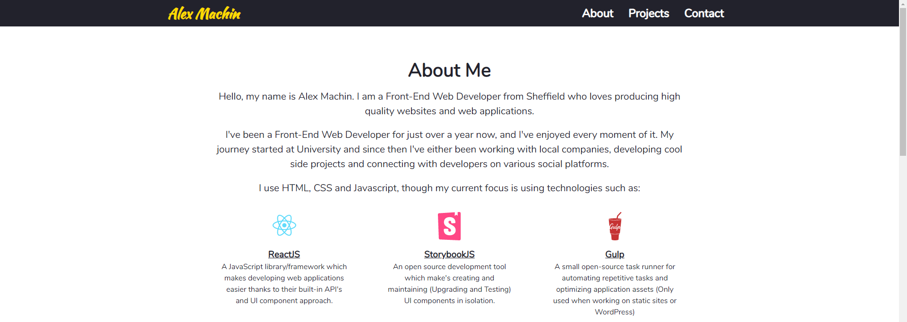

<h1 align="center">
    
</h1>

<h2 align="center">
	Portfolio Website 🚀
</h2>

<h3 align="center">
  

  

  

  

  

</h3>

## About the project

This is the repository for my personal portfolio website, it was built using a blazing fast framework known as Remix.

A screenshot of my portfolio can be seen below.

<h3 align="left">
    
</h3>

## README contents

As part of the README file it will describe and explain the following sections:

- Technologies used
- Getting Started
- Contributing
- Project Information

## Technologies used:

### Core Dependencies

- [@netlify/functions](https://github.com/netlify/functions.netlify.com)
- [@remix-run/netlify](https://www.npmjs.com/package/@remix-run/netlify)
- [@remix-run/node](https://www.npmjs.com/package/@remix-run/node)
- [@remix-run/react](https://www.npmjs.com/package/@remix-run/react)
- [react](https://www.npmjs.com/package/react)
- [react-dom](https://www.npmjs.com/package/react-dom)
- [styled-components](https://www.npmjs.com/package/styled-components)
- [styled-icons](https://www.npmjs.com/package/styled-icons)
- [yup](https://www.npmjs.com/package/yup)

### Development Dependencies

- [cross-env](https://www.npmjs.com/package/cross-env)
- [@remix-run/dev](https://www.npmjs.com/package/@remix-run/dev)
- [@remix-run/eslint-config](https://www.npmjs.com/package/@remix-run/eslint-config)
- [@types/react](https://www.npmjs.com/package/@types/react)
- [@types/react-dom](https://www.npmjs.com/package/@types/react-dom)
- [@types/styled-components](https://www.npmjs.com/package/@types/styled-components)
- [autoprefixer](https://www.npmjs.com/package/autoprefixer)
- [concurrently](https://www.npmjs.com/package/concurrently)
- [eslint](https://www.npmjs.com/package/eslint)
- [eslint-config-airbnb](https://www.npmjs.com/package/eslint-config-airbnb)
- [eslint-config-prettier](https://www.npmjs.com/package/eslint-config-prettier)
- [eslint-plugin-import](https://www.npmjs.com/package/eslint-plugin-import)
- [eslint-plugin-jsx-a11y](https://www.npmjs.com/package/eslint-plugin-jsx-a11y)
- [eslint-plugin-prettier](https://www.npmjs.com/package/eslint-plugin-prettier)
- [eslint-plugin-react](https://www.npmjs.com/package/eslint-plugin-react)
- [eslint-plugin-react-hooks](https://www.npmjs.com/package/eslint-plugin-react-hooks)
- [postcss](https://www.npmjs.com/package/postcss)
- [prettier](https://www.npmjs.com/package/prettier)
- [prettier-plugin-tailwindcss](https://www.npmjs.com/package/prettier-plugin-tailwindcss)
- [tailwindcss](https://www.npmjs.com/package/tailwindcss)
- [typescript](https://www.npmjs.com/package/typescript)

## Getting started

- Clone the project to your development environment by using `git clone https://github.com/AlexMachin1997/alexmachin.co.uk.git`

- Install all dependencies via using the "yarn" command in the command line

## Contributing

### Reporting issues

If you find any problems while using the application, report them [here](https://github.com/AlexMachin1997/alexmachin.co.uk/issues), and I will address them as quick as I can.

### Feature requests

If you would like to request features for future versions of the application again, please post them [here](https://github.com/AlexMachin1997/alexmachin.co.uk/issues). When posting ideas ensure the functionality is explained to provide any developers contributing to the project know what to implement.

### Implementing features

If you would like to implement a feature in the issues list or refactor existing code (Without breaking any existing functionality), feel free to form the repo and submit a [PR](https://github.com/AlexMachin1997/alexmachin.co.uk/pulls) detailing all the changes made.

## Project Information

### Author information

Alex Machin

If you want to connect with me on my professional social network platforms feel free to use the links located below, but please don't abuse them.

- [LinkedIn](https://www.linkedin.com/in/alex-machin/)
- [Twitter](https://twitter.com/AlexMachin97)
- [Instagram](https://www.instagram.com/alexmachin1997/?hl=en)

### Application Versioning

The application is currently at version 2.0.0, with each feature added it will increment based on these [guidelines](https://docs.npmjs.com/about-semantic-versioning)

### Project License information

This project is licensed under the MIT License, for more details about the portfolio refer to the LICENSE.md file located within the project.
