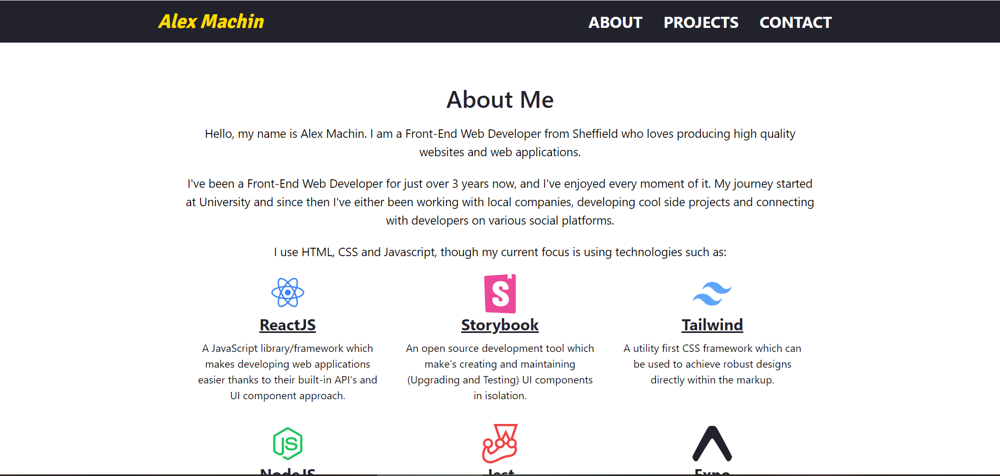

<h1 align="center">
    
</h1>

<h2 align="center">
	Portfolio Website 🚀
</h2>

<h3 align="center">

  

  

  

  

  

  

  

</h3>

## About the project

This is the repository for my personal portfolio website, it was built using a blazing fast tool known as Gatsby.

A screenshot of my portfolio can be seen below.

<h3 align="left">
    
</h3>

## README contents

As part of the README file it will describe and explain the following sections:

- Technologies used
- Getting Started
- Contributing
- Portfolio Improvements
- Project Information

## Technologies used:

### Core Dependencies

- [@reach-router](https://github.com/reach/router)
- [axios](https://github.com/axios/axios)
- [babel-plugin-styled-components](https://github.com/styled-components/babel-plugin-styled-components)
- [dotenv](https://github.com/motdotla/dotenv)
- [gatsby](https://github.com/gatsbyjs/gatsby)
- [gatsby-image](https://github.com/gatsbyjs/gatsby/tree/master/packages/gatsby-image)
- [gatsby-plugin-google-analytics](https://github.com/gatsbyjs/gatsby/tree/master/packages/gatsby-plugin-google-analytics)
- [gatsby-plugin-google-fonts](https://github.com/didierfranc/gatsby-plugin-google-fonts)
- [gatsby-plugin-manifest](https://github.com/gatsbyjs/gatsby/tree/master/packages/gatsby-plugin-manifest)
- [gatsby-plugin-react-helmet](https://github.com/gatsbyjs/gatsby/tree/master/packages/gatsby-plugin-react-helmet)
- [react-helmet](https://github.com/nfl/react-helmet)
- [gatsby-plugin-robots-txt](https://github.com/mdreizin/gatsby-plugin-robots-txt)
- [gatsby-plugin-sharp](https://github.com/gatsbyjs/gatsby/tree/master/packages/gatsby-plugin-sharp)
- [gatsby-plugin-sitemap](https://github.com/gatsbyjs/gatsby/tree/master/packages/gatsby-plugin-sitemap)
- [styled-components](https://github.com/styled-components/styled-components)
- [gatsby-plugin-styled-components](https://github.com/gatsbyjs/gatsby/tree/master/packages/gatsby-plugin-styled-components)
- [gatsby-source-filesystem](https://github.com/gatsbyjs/gatsby/tree/master/packages/gatsby-source-filesystem)
- [gatsby-transformer-sharp](https://github.com/gatsbyjs/gatsby/tree/master/packages/gatsby-transformer-sharp)
- [prop-types](https://github.com/facebook/prop-types)
- [react](https://github.com/facebook/react)
- [react-dom](https://github.com/facebook/react)
- [react-hook-form](https://github.com/react-hook-form/react-hook-form)
- [styled-icons](https://github.com/styled-icons/styled-icons)

### Development Dependencies

- [eslint-config-airbnb](https://www.npmjs.com/package/eslint-config-airbnb)
- [esling-config-prettier](https://www.npmjs.com/package/eslint-config-prettier)
- [eslint-plugin-import](https://www.npmjs.com/package/eslint-plugin-import)
- [eslint-plugin-react](https://www.npmjs.com/package/eslint-plugin-react)
- [eslint-plugin-react-hooks](https://www.npmjs.com/package/eslint-plugin-react-hooks)
- [eslint-plugin-prettier](https://www.npmjs.com/package/eslint-plugin-prettier)
- [prettier](https://www.npmjs.com/package/prettier)

## Getting started

- Clone the project to your development environment by using `git clone https://github.com/AlexMachin1997/alexmachin.co.uk.git`

- Install all dependencies for the application by issuing this command `npm coreDependencies` **(Excludes all development dependencies e.g. eslint, prettier etc)**

## Contributing

### Reporting issues

If you find any problems while using the application, report them [here](https://github.com/AlexMachin1997/alexmachin.co.uk/issues), and I will address them as quick as I can.

### Feature requests

If you would like to request features for future versions of the application again, please post them [here](https://github.com/AlexMachin1997/alexmachin.co.uk/issues). When posting ideas ensure the functionality is explained to provide any developers contributing to the project know what to implement.

### Implementing features

If you would like to implement a feature in the issues list or refactor existing code (Without breaking any existing functionality), feel free to form the repo and submit a [PR](https://github.com/AlexMachin1997/alexmachin.co.uk/pulls) detailing all the changes made.

## Portfolio Improvements

### General

- [x] Integrate gatsby-image for image optimization
- [x] Integrate React-Hook-Form for updating form values, form validation, input events etc
- [x] Integrate gatsby-transformer-sharp for optimizing assets at built time
- [x] Integrate Google Analytics for page tracking
- [ ] Integrate OutboundLink for tracking social media link usage (Ask via the Google Analytics plugin github repository)
- [x] Generate a basic manifest to support favicons
- [x] Integrate social media link's via the gatsby-node
- [ ] Look into a light and dark mode functionality

### PWA

- [ ] Generate 16x16, 32x32, 196x196 icons for the manifest (Currently only has a 16x16 which isn't great. Need to find a way to create icons efficiently)
- [ ] Add offline caching for browser
- [ ] Add an "Add to home screen message" (Requires the app to meet the manifest requirements from Google)
- [ ] Add an update notification via gatsby-node api (https://www.youtube.com/watch?v=w94-d9sRWMw)
- [ ] Improve mobile performance

## Project Information

### Author information

Alex Machin

If you want to connect with me on my professional social network platforms feel free to use the links located below, but please don't abuse them.

- [LinkedIn](https://www.linkedin.com/in/alex-machin/)
- [Twitter](https://twitter.com/AlexMachin97)
- [Instagram](https://www.instagram.com/alexmachin1997/?hl=en)

### Application Versioning

The application is currently at version 2.0.0, with each feature added it will increment based on these [guidelines](https://docs.npmjs.com/about-semantic-versioning)

### Project Licence information

This project is licensed under the MIT License, for more details about the portfolio refer to the LICENSE.md file located within the project.
